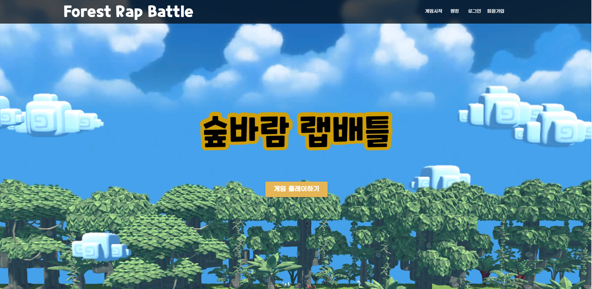
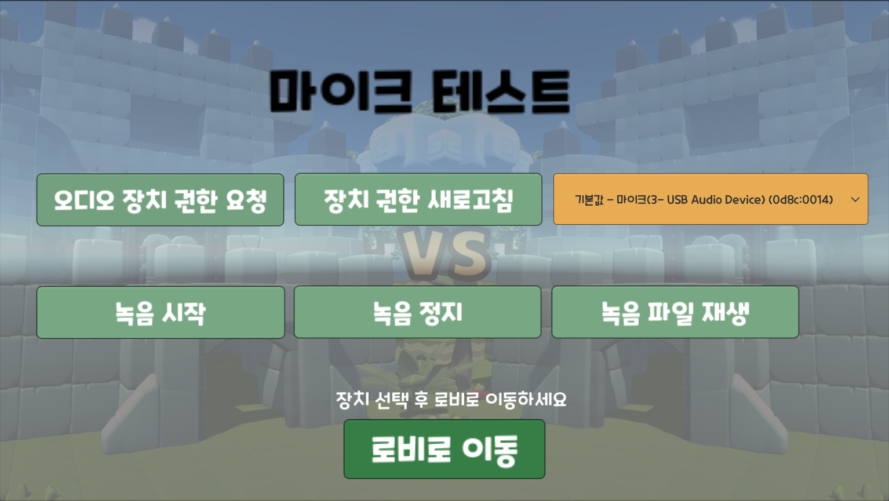
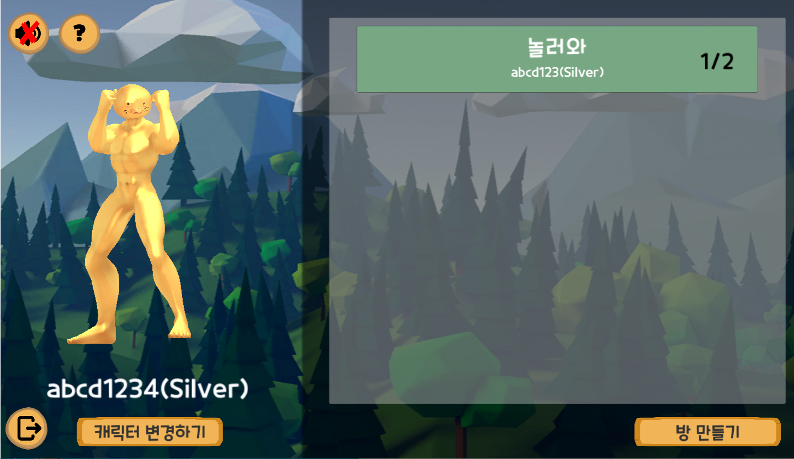
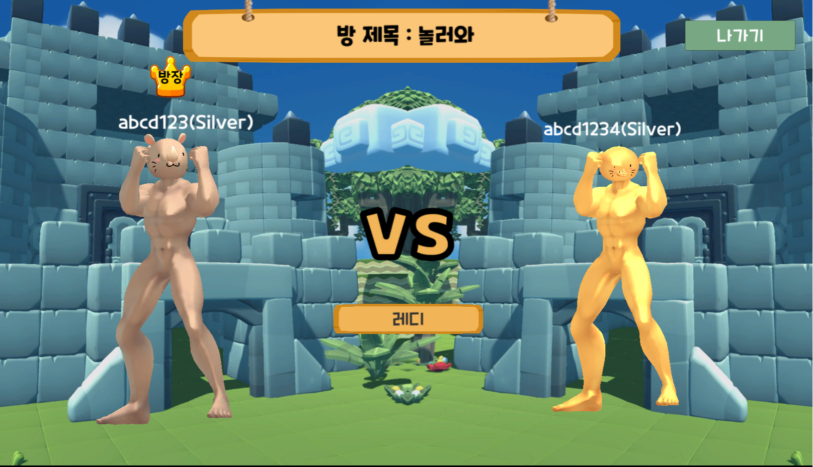
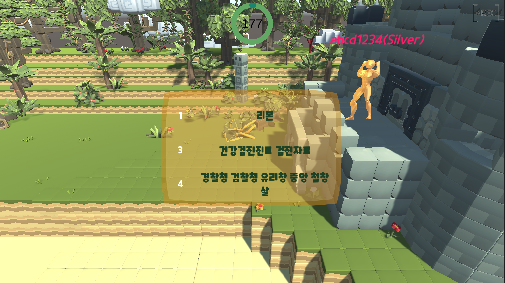
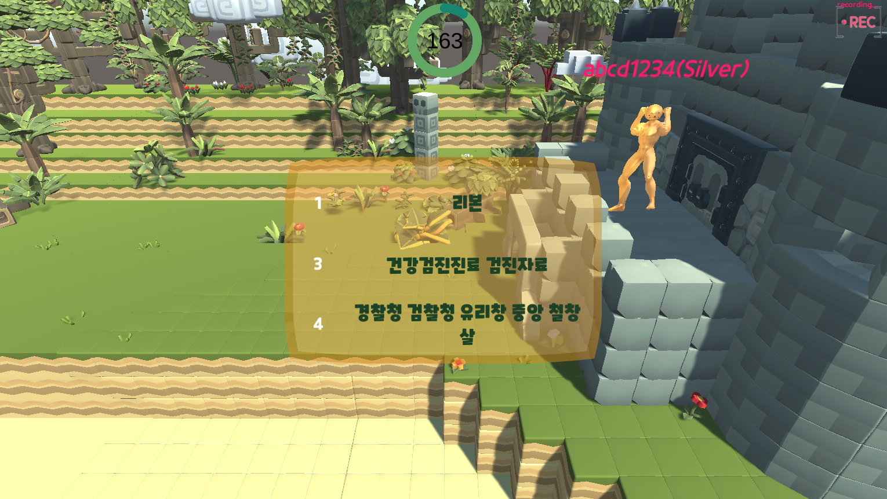
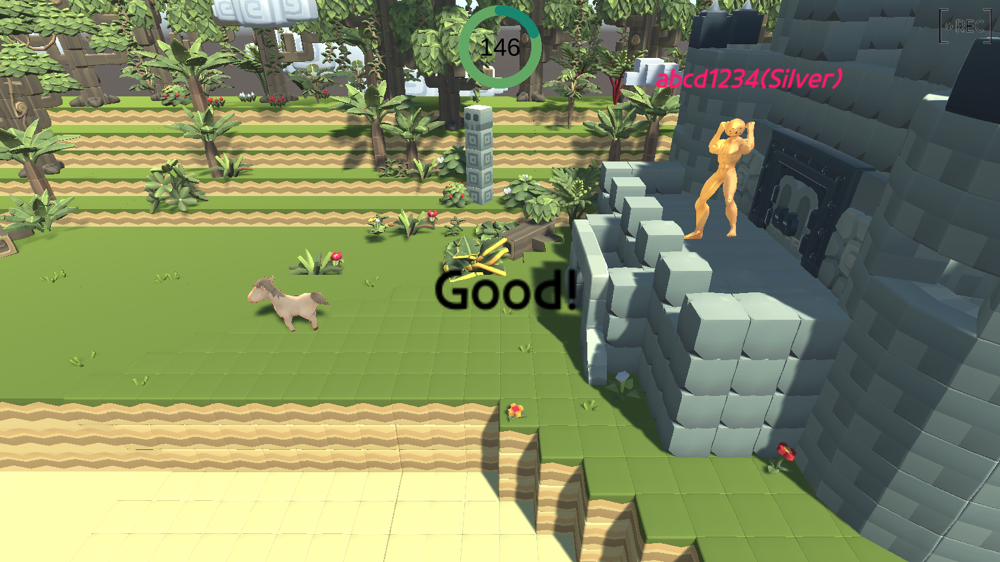

# 부울경 2반 E204 자율 프로젝트

## 프로젝트 소개

- 프로젝트명 : **숲바람 랩배틀**
- 개발 기간: 2022.04.11 ~ 2022.05.20

- AI 음성 인식을 이용한 발음 연습 게임 서비스
  - Unity를 이용한 게임이며 동물 캐릭터로 대결을 펼쳐서 사람들의 친근감을 유발하고, 음성 인식을 통해 발음 연습을 유도하고 테스트 해보는 Web 서비스 입니다. 

## 주요 기능

- Unity 기반의 동물 대결
- AI 음성분석을 통한 정확한 발음 연습 및 테스트

## 세부 기능

| 구분 | 기능           | 설명                                                         | 비고 |
| :--- | :------------- | :----------------------------------------------------------- | :--- |
| 1    | 동물 대결      | 평화로운 숲속에서 능력이 다른 동물들이 대결                  |      |
| 2    | 발음 연습      | 다양한 잿말들을 랜덤으로 뽑아내어 사용자가 말을 직접 하고 들어볼 수 있다. |      |
| 3    | 평가 지표 제공 | 발음의 정확도에 따라서 동물들의 다양한 능력치를 나타낸다.    |      |

## 설치 및 실행
[설치 및 실행](https://lab.ssafy.com/s06-final/S06P31E204/-/tree/docs/exec)

## 사용 예시
#### 메인페이지

> 로그인을 해서 게임을 시작할 수 있습니다.

#### 마이크 설정 화면

>  마이크를 설정하고 소리가 들리는지 확인할 수 있습니다.

#### 채널 로비 화면

> 들어가고 싶은 방을 선택해서 들어갈 수 있습니다.

#### 게임 대기 화면

> 방장은 유저를 강퇴할 수 있는 기능과 시작할 수 있는 권한이 있고 참가자는 준비를 할 수 있습니다.

#### 단어 목록 제공

> Level 1 ~ Level 5까지 150개의 단어를 랜덤으로 뽑아내서 발음을 연습할 수 있습니다.

#### 녹음 화면

> Space bar를 이용해서 누르고 있으면 녹음이 진행되고 손에서 뗄 경우 녹음이 중지됩니다.

#### 점수 및 소환 화면

> 주어진 단어 3개 중 자신이 발음한 단어의 유사도 점수가 가장 높은것을 토대로 성공 여부 멘트와 함께 점수를 토대로 동물 유닛이 소환됩니다.

#### 게임 종료 화면

> 많은 유닛을 소환하여 상대방의 성을 무너뜨리거나 타이머가 종료된 시점에 성의 체력이 높은 유저가 승리하게 됩니다.

## 프로젝트 명세

#### 1. 아키텍처

#### 2. ERD

#### 3. 와이어프레임

#### 4. 클래스 다이어그램

#### 5. 기능 명세서

## 팀원 소개

>  팀명 : 부산없는 부산팀

<table>
  <tr>
    <td align="center"><a href="https://github.com/HKLM93"> <b>최명재 AI, 팀장</b></a> </td>
    <td align="center"><a href="https://github.com/DHKim95"> <b>김도훈 AI</b></a> </td>
    <td align="center"><a href="https://github.com/xogxog"> <b>김태현 Back-end</b></a> </td>
    <td align="center"><a href="https://github.com/cmsj72"> <b>윤찬호 Unity</b></a> </td>
    <td align="center"><a href="https://github.com/eunnuricho"> <b>조은누리 Unity</b></a> </td>
    <td align="center"><a href="https://github.com/choiys1995"> <b>조성현 Front-end</b></a> </td>
    </tr>
</table>
